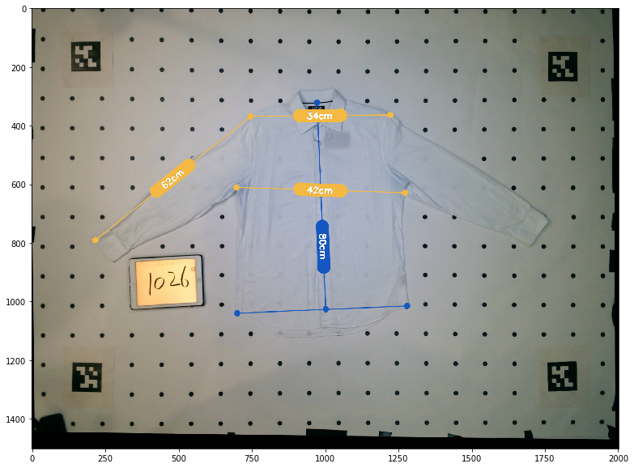

# Draw Labels

A package for drawing graphical labels on images. 

Used for drawing labels from keypoints on images, and labeling with distances or measurements. 

## Requirements
- OpenCV 3.4+ 
- Numpy 1.15+

## Usage

````
import cv2
import numpy as np

# Read image
image = cv2.imread('example/example.png')

# Label the line between 2 points (p1, p2)
p1 = np.array([746, 369])
p2 = np.array([217, 791])
text = "example"

# Draw
from draw_labels.draw import draw_label
image = draw_label(image, [p1, p2], text)

cv2.imshow(image)
````

## Example

````
python ./run_example.py
````




